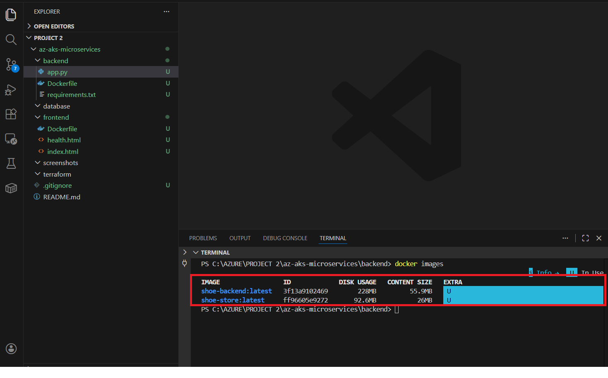
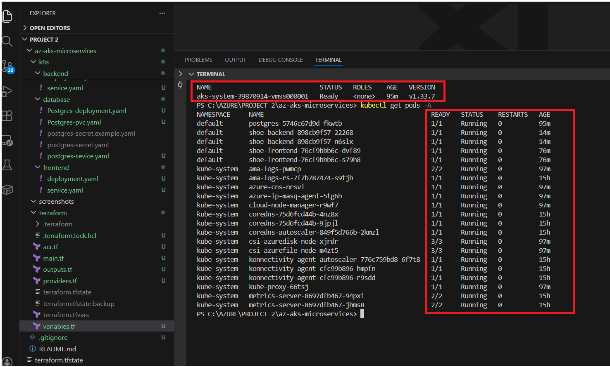

## README.md File

# Containerized Microservices Deployment on Azure Kubernetes Service (AKS) Using Terraform

This project showcases a cloud-native microservices application deployed on Azure Kubernetes Service, built using containerization, Infrastructure-as-Code, and Kubernetes orchestration.

The environment is provisioned using Terraform, application services are packaged with Docker, and container images are stored in Azure Container Registry before being deployed to a managed Kubernetes cluster.

The architecture follows a modular microservices design where each service runs independently in Kubernetes, enabling scalability, resilience, and simplified service management.

Application Architecture

The system is structured as a three-tier microservices architecture, with each layer deployed as a containerized workload inside the Kubernetes cluster.

- **Frontend** –

A lightweight web interface served through an Nginx container, responsible for presenting the user interface and sending requests to backend services.

- **Backend** –

A Python-based REST API that handles application logic, processes requests from the frontend, and communicates with the database.

- **Database** – 

A PostgreSQL database deployed with persistent storage to maintain data durability across pod restarts and rescheduling.

## Infrastructure Components

Azure Kubernetes Service (AKS) for container orchestration
Azure Container Registry (ACR) for secure image storage
Terraform for declarative infrastructure provisioning
Docker for container build and packaging

## Deployment Guide

### Build Docker Images


docker build -t shoe-frontend:v1 ./frontend

docker build -t shoe-backend:v1 ./backend

Built images


### Tag Image with ACR URL


docker tag shoe-frontend:v1 bunmiacr080.azurecr.io/shoe-frontend:v1

docker tag shoe-backend:v1 bunmiacr080.azurecr.io/shoe-backend:v1

## Push Images to Azure Container Registry

docker push bunmiacr080.azurecr.io/shoe-frontend:v1

docker push bunmiacr080.azurecr.io/shoe-backend:v1

Images in ACR


## Provisioned Azure Kubernetes Services (AKS) with Terraform

terraform plan


terraform apply


### Deploy to Kubernetes

- Apply the Kubernetes manifests in order:
- kubectl apply -f k8s/database/
- kubectl apply -f k8s/backend/
- kubectl apply -f k8s/frontend/


## AKS Nodes and Pods After deployment

kubectl get nodes and pods



## Service Access

- Frontend: Exposed via LoadBalancer (External IP)
- Backend: Internal ClusterIP service
- Database: Internal ClusterIP service


Service IPs


## Application Access

Browser image


## Key Skills Demonstrated

- Azure Kubernetes Service (AKS)
- Azure Container Registry (ACR)
- Docker & Containerization
- Kubernetes (Deployments, Services, Namespaces)
- Infrastructure as Code with Terraform
- Microservices Architecture
- Cloud Networking & Load Balancing


## Repository Structure

```
├── README.md
├── backend
│   ├── Dockerfile      
│   ├── app.py
│   └── requirements.txt
├── docs
│   ├── browser image.png
│   ├── docker images.png
│   ├── images in acr1.png
│   ├── images in acr2.png
│   ├── kubectl-get-nodes-and-pods.png
│   ├── service ips.png
│   ├── terraform apply.png
│   └── terraform plan.png
├── frontend
│   ├── Dockerfile
│   ├── health.html
│   └── index.html
├── k8s
│   ├── backend
│   │   ├── deployment.yaml
│   │   └── service.yaml
│   ├── database
│   │   ├── Postgres-deployment.yaml
│   │   ├── Postgres-pvc.yaml
│   │   ├── postgres-secret.example.yaml
│   │   ├── postgres-secret.yaml
│   │   └── postgres-sevice.yaml
│   └── frontend
│       ├── deployment.yaml
│       └── service.yaml
└── terraform
    ├── acr.tf
    ├── main.tf
    ├── outputs.tf
    ├── providers.tf
    ├── terraform.tfstate
    ├── terraform.tfstate.backup
    ├── terraform.tfvars
    └── variables.tf


Author

Bunmi Orunmbe

Azure Cloud Engineer

Certifications

• AZ-104 – Microsoft Azure Administrator